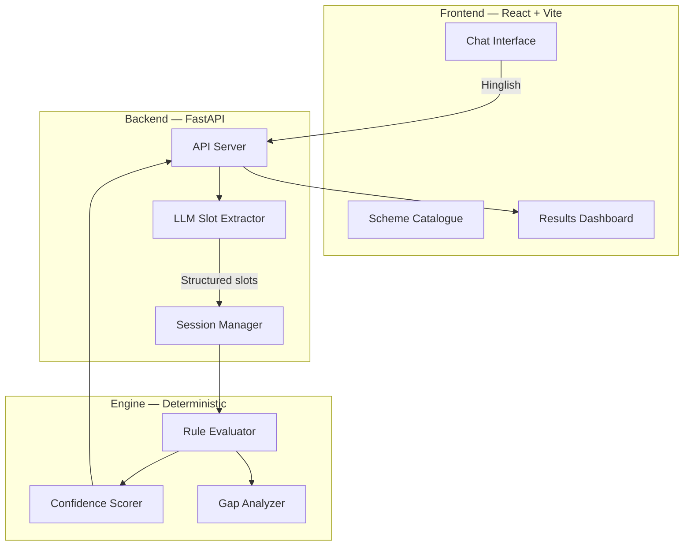

# KALAM — Welfare Eligibility Intelligence Engine

> **K**nowledge-**A**ware **L**anguage-enabled **A**ccess to entitle**M**ents

KALAM is an AI-powered eligibility engine that helps Indian citizens discover which central government welfare schemes they qualify for, through a natural Hinglish conversational interface.

🔗 **Live Demo**: [kalam.vedantsanghi.me](https://kalam.vedantsanghi.me)

---

## ✅ Project Deliverables

| # | Deliverable | Status | Location |
|---|-------------|--------|----------|
| 1 | Structured eligibility rules for 15+ central government schemes | ✅ **30 schemes** | [`schemes/`](schemes/) — 30 YAML files |
| 2 | Ambiguity map documenting contradictions and overlaps | ✅ Complete | [`docs/ambiguity_map.md`](docs/ambiguity_map.md) |
| 3 | Working matching engine with explainable confidence scores | ✅ Complete | [`engine/`](engine/) — evaluator, confidence, gap analysis |
| 4 | Ten adversarial edge-case profiles with documented results | ✅ Complete | [`edge_cases/`](edge_cases/) — 10 profiles, full results |
| 5 | Conversational interface supporting Hinglish natural language | ✅ Complete | [`frontend/`](frontend/) + [`conv/`](conv/) |
| 6 | Architecture document with system diagram and technical decisions | ✅ Complete | [`docs/architecture.md`](docs/architecture.md) |

---

## Architecture



**Key principle**: LLMs handle natural language understanding only. All eligibility decisions are made by a deterministic rule evaluator — no hallucination in the critical path.

---

## 30 Government Schemes

| # | Scheme | Category | Benefit |
|---|--------|----------|---------|
| 1 | PM-KISAN | Agriculture | ₹6,000/year |
| 2 | PM Kisan Mandhan | Pension | ₹3,000/month pension |
| 3 | KCC (Kisan Credit Card) | Credit | Crop loans at 4% |
| 4 | PMFBY (Fasal Bima) | Insurance | Crop insurance |
| 5 | MGNREGA | Employment | 100 days guaranteed work |
| 6 | MUDRA | Business | Loans up to ₹10 lakh |
| 7 | PM-SVANidhi | Business | ₹50,000 for street vendors |
| 8 | PM Vishwakarma | Skill/Business | ₹3 lakh for artisans |
| 9 | Stand-Up India | Business | ₹1 crore for SC/ST/women |
| 10 | PMJDY | Banking | Zero-balance bank account |
| 11 | PMJJBY | Insurance | ₹2 lakh life cover |
| 12 | PMSBY | Insurance | ₹2 lakh accident cover |
| 13 | APY (Atal Pension) | Pension | ₹1,000–₹5,000/month |
| 14 | PM-SYM | Pension | ₹3,000/month for unorganized workers |
| 15 | PMAY-G (Gramin) | Housing | ₹1.2–1.3 lakh for rural housing |
| 16 | PMAY-U (Urban) | Housing | Subsidized urban housing |
| 17 | PMUY (Ujjwala) | Energy | Free LPG connection |
| 18 | PMJAY (Ayushman Bharat) | Health | ₹5 lakh health cover |
| 19 | PMMVY (Matru Vandana) | Women | ₹11,000 for pregnant women |
| 20 | SSY (Sukanya Samriddhi) | Savings | Girl child savings scheme |
| 21 | PMKVY | Skill | Free skill training |
| 22 | DDU-GKY | Skill | Rural youth skilling |
| 23 | PM YASASVI | Education | Scholarships for OBC/SC/ST |
| 24 | NRLM | Livelihood | SHG-based livelihood support |
| 25 | NMMSS | Scholarship | Merit scholarship for minorities |
| 26 | IGNOAPS | Pension | Old-age pension (60+) |
| 27 | IGNWPS | Pension | Widow pension |
| 28 | IGNDPS | Pension | Disability pension |
| 29 | NSAP/NFBS | Social Security | ₹20,000 family benefit |
| 30 | Annapurna | Food Security | 10 kg free foodgrains/month |

---

## Eligibility Engine

### Four-State Output Model

```
QUALIFIES        → All verifiable rules pass
ALMOST_QUALIFIES → Failed on changeable criteria (e.g., missing bank account)
DOES_NOT_QUALIFY → Failed on unchangeable criteria (age, gender, caste)
UNCERTAIN        → Cannot determine — missing data could change outcome
```

### Confidence Scoring

Each scheme result includes an explainable confidence score:

```
confidence = base × completeness × cleanliness × freshness

base         = 1.0 (qualifies) or 0.0 (doesn't)
completeness = 1.0 - (unknown_rules / total_rules)
cleanliness  = 1.0 - (ambiguity_flags / total_rules)
freshness    = 1.0 (current) or 0.8 (stale data)
```

### Predicate Language

Rules use a safe, deterministic predicate language (no `eval()`):

```yaml
- predicate: age BETWEEN 18 AND 50
- predicate: occupation IN ['farmer','laborer','artisan']
- predicate: has_aadhaar == True AND has_bank_account == True
- predicate: annual_income_inr <= 200000
- predicate: NOT income_tax_filed_last_ay == True
```

---

## Edge Case Testing

10 adversarial profiles test boundary conditions:

| Profile | Challenge | Key Finding |
|---------|-----------|-------------|
| Remarried Widow | is_widow + remarried | Correctly qualifies for non-widow-specific schemes |
| Tenant Farmer | Leased land, not owned | ALMOST_QUALIFIES for PM-KISAN correctly |
| No Bank Account | Aadhaar only | Flags PMJDY as prerequisite |
| Transgender | sex='other' + pregnant | Gender-specific schemes correctly handled |
| Missing Husband | is_widow=UNKNOWN | UNCERTAIN propagated correctly |
| Single Father | Male + daughter_under_10 | Qualifies for SSY (as legal guardian) |
| Age Boundary (18) | Exact cut-off | Inclusive boundaries work correctly |
| Wealthy Farmer | Tax-filing farmer | PM-KISAN exclusion rule triggers |
| Elderly (70) | Above most age limits | Max-age schemes correctly filtered |
| Street Vendor | No PAN card | PM-SVANidhi qualification works |

Full results: [`edge_cases/results.md`](edge_cases/results.md)

---

## Tech Stack

| Layer | Technology |
|-------|-----------|
| Frontend | React 19, Vite, Tailwind CSS, Framer Motion |
| Backend | FastAPI, Uvicorn, Python 3.11 |
| NLU | Sarvam AI (sarvam-m model) |
| Data Store | 30 YAML files (version-controlled) |
| Deployment | Vercel (frontend) + Render (backend) |

---

## Local Development

### Prerequisites
- Python 3.11+
- Node.js 20+
- Sarvam API key

### Setup

```bash
# Clone
git clone https://github.com/vedantsanghi7/CBCKalam.git
cd CBCKalam

# Backend
python -m venv venv
source venv/bin/activate
pip install -r requirements.txt
echo "SARVAM_API_KEY=your_key_here" > .env
uvicorn api.server:app --port 8000

# Frontend (new terminal)
cd frontend
npm install
npm run dev
```

Open http://localhost:5173

### Run Edge Case Tests

```bash
python edge_cases/run_tests.py
```

---

## Project Structure

```
kalam/
├── api/                    # FastAPI backend
│   └── server.py           # API server with session management
├── conv/                   # Conversational NLU
│   └── nlu.py              # LLM slot extraction via Sarvam
├── engine/                 # Deterministic eligibility engine
│   ├── evaluator.py        # Rule evaluator (predicate parser)
│   ├── confidence.py       # Confidence score calculator
│   ├── gap_analysis.py     # Gap analyzer for ALMOST cases
│   └── models.py           # Pydantic data models
├── schemes/                # 30 YAML scheme definitions
│   ├── pm_kisan.yaml
│   ├── pmjjby.yaml
│   └── ... (28 more)
├── frontend/               # React + Vite frontend
│   └── src/
│       ├── pages/          # Chat, Schemes, Results, etc.
│       ├── components/     # UI components
│       └── lib/            # API client, i18n
├── docs/
│   ├── architecture.md     # System architecture & decisions
│   └── ambiguity_map.md    # Cross-scheme ambiguity analysis
├── edge_cases/
│   ├── profiles.yaml       # 10 adversarial test profiles
│   ├── results.md          # Evaluation results
│   └── run_tests.py        # Test runner script
├── ambiguity/
│   └── analyzer.py         # Automated ambiguity scanner
├── requirements.txt
├── render.yaml             # Render deployment config
└── README.md               # This file
```

---

## License

Built for the CBC Hackathon 2026. All scheme data sourced from public government portals ([myscheme.gov.in](https://www.myscheme.gov.in)).
