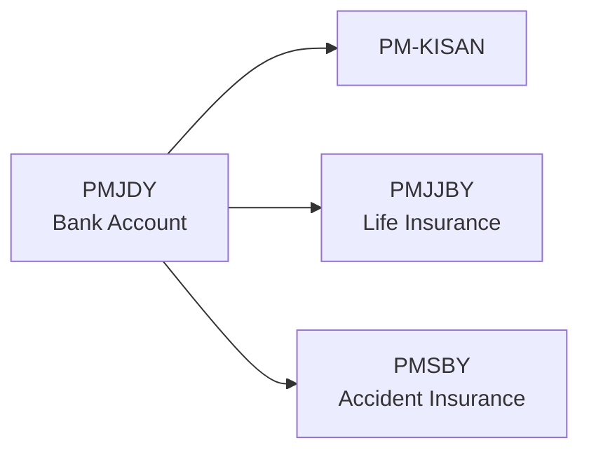

# Ambiguity Map — Cross-Scheme Contradictions & Overlaps

> **Scope**: 30 central government welfare schemes  
> **Last Updated**: April 2026  
> **Engine**: KALAM Welfare Eligibility Intelligence

## Summary

| Category | Count | Details |
|----------|-------|---------|
| Scheme Overlaps | 2 | PM-KISAN ↔ PM-KISAN Mandhan auto-opt |
| Ambiguity Flags | 12 | 7 STATE_DEPENDENT, 2 UNDEFINED_TERM, 1 DISCRETIONARY |
| Prerequisite Chains | 3 | PM-KISAN, PMJJBY, PMSBY all soft-require PMJDY |
| Contradictions | 0 | No direct logical contradictions detected |

---

## 1. Scheme Overlaps

### PM-KISAN ↔ PM-KISAN Mandhan (PM-KMY)

| Scheme A | Scheme B | Nature |
|----------|----------|--------|
| `PM_KISAN` | `PM_KISAN_MANDHAN` | PM-KISAN beneficiaries are auto-opted for PM-KMY pension contributions |

**Impact**: A farmer qualifying for PM-KISAN (₹6,000/year) is automatically enrolled in PM-KMY (pension). The engine correctly identifies both independently but does not currently model the auto-opt flow.

**Resolution**: Both schemes are returned in results. The `prerequisites` field links them.

---

## 2. Prerequisite Chains

Several schemes require a basic bank account, creating a natural sequencing dependency:



All three prerequisites are marked `soft: true` — they don't block evaluation but are surfaced as recommendations when `has_bank_account == false`.

---

## 3. Ambiguity Flags

### 3.1 STATE_DEPENDENT (7 flags)

These rules have eligibility criteria that vary by state:

| Scheme | Rule | Notes |
|--------|------|-------|
| `DDU_GKY` | `DGKY_R003` | Training availability and beneficiary limits vary by state |
| `IGNDPS` | `DPS_R001` | Disability pension amount varies ₹300–₹1,500 across states |
| `IGNOAPS` | `IGNOAPS_R002` | Old-age pension thresholds differ by state |
| `IGNWPS` | `IGNWPS_R001` | Definition of "widow" (remarriage, missing-husband) varies by state |
| `KCC` | `KCC_R002` | Tenancy documentation varies — informal tenants often rejected |
| `NRLM` | `NRLM_R003` | SHG formation rules and support structures vary |
| `PMAY_G` | `PMAYG_R002` | Housing allotment lists are state-managed |
| `PMJAY` | `PMJAY_R001` | States like Kerala, Delhi extend coverage with state schemes |
| `PMUY` | `PMUY_R002` | LPG cylinder subsidies have state-level variations |

**Engine handling**: The engine evaluates central rules only and flags `STATE_DEPENDENT` in the ambiguity notes. A future extension would load state-specific rule overrides from `state/*.yaml` files.

### 3.2 UNDEFINED_TERM (2 flags)

| Scheme | Rule | Term | Notes |
|--------|------|------|-------|
| `PM_KISAN` | `PMK_R002` | "Institutional landholder" | The source text excludes institutional landholders but does not define the term. Engine cannot evaluate this rule deterministically. |
| `PMMVY` | `PMMVY_R001` | Gender definition | Transgender applicants (sex='other') face ambiguity — PMMVY requires sex='F' but does not address transgender individuals explicitly. |

**Engine handling**: UNDEFINED_TERM rules are evaluated strictly. If the predicate cannot resolve, it returns UNKNOWN, which is surfaced in the confidence breakdown.

### 3.3 DISCRETIONARY (1 flag)

| Scheme | Rule | Notes |
|--------|------|-------|
| `SSY` | `SSY_R001` | Sukanya Samriddhi allows legal guardians, but single-father / non-natural-guardian cases may require extra documentation at the bank level. |

**Engine handling**: The engine qualifies legal guardians but flags the discretionary note for the user.

---

## 4. Cross-Scheme Contradiction Analysis

**No contradictions detected.** All 30 schemes have logically consistent rules:
- No two schemes have mutually exclusive eligibility that would logically conflict
- The only overlap (PM-KISAN ↔ PM-KMY) is intentionally complementary
- Age ranges across schemes are disjoint or overlapping by design (e.g., PMJJBY 18-50, IGNOAPS 60+)

### Age Domain Coverage

```
Scheme          |10  15  18  20  30  40  50  60  65  70+
PM YASASVI      |████████████████░░░░░░░░░░░░░░░░░░░░░░░  13-22
DDU-GKY         |░░░████████████████████░░░░░░░░░░░░░░░░░  15-35
APY             |░░░░░░████████████████████████░░░░░░░░░░░  18-40
PMJJBY          |░░░░░░████████████████████████████░░░░░░░  18-50
MGNREGA         |░░░░░░████████████████████████████████████  18+
IGNOAPS         |░░░░░░░░░░░░░░░░░░░░░░░░░░░░░░░░████████  60+
ANNAPURNA       |░░░░░░░░░░░░░░░░░░░░░░░░░░░░░░░░░░██████  65+
```

---

## 5. Methodology

1. **Automated scan**: `ambiguity/analyzer.py` scans all 30 YAML files for `ambiguity_flags`, `overlaps_with`, and `prerequisites`
2. **Predicate conflict detection**: Rule predicates are compared for logical contradictions (e.g., scheme A requires `is_bpl == True` while scheme B requires `is_bpl == False` for the same benefit type)
3. **Edge case testing**: 10 adversarial profiles (see `edge_cases/`) stress-test boundary conditions and ambiguous inputs
4. **Human review**: Each ambiguity flag was verified against source documents cited in the YAML `sources` field
