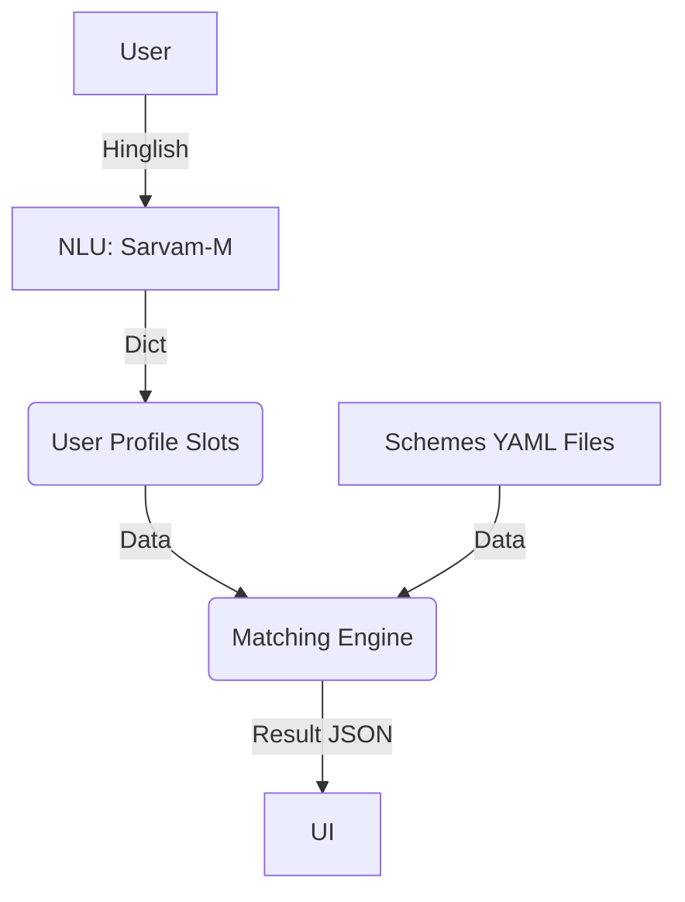

# KALAM Architecture Document

## System Diagram

## Decisions
1. **Rule Store as YAML**: YAML was selected for deterministic verifiability rather than an LLM interpreting unstructured guidelines in real time which leads to hallucinations.
2. **LLM Parser Only**: SARVAM AI models are used only upstream in the parsing/NLU paths to interpret language, not to determine logic and decisions.
3. **Uncertainty Flagging Output**: A 4-state output mechanism was preferred, as omitting an answer (with explainability) is better than a fabricated `True`/`False`.

## Production Gaps
1. **Rule Freshness Data Updates**: Cached data updates requires chronological synchronization via a CRON pipeline to monitor site updates.
2. **State Variation Logic**: Handling 50 varying states with overlapping localized laws. Recommended extension: nested `state/*.yaml` properties inside every scheme configuration.
