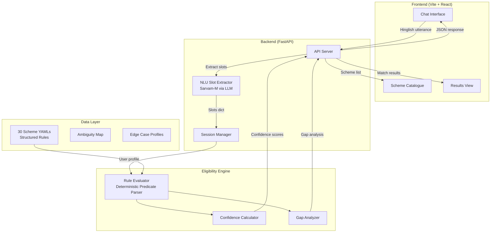

# KALAM Architecture Document

## Overview

KALAM (**K**nowledge-**A**ware **L**anguage-enabled **A**ccess to entitle**M**ents) is a welfare eligibility intelligence engine that determines a citizen's eligibility across 30 central government schemes using structured rule evaluation, conversational slot-filling, and Sarvam AI's multilingual NLU capabilities.

## System Architecture



## Component Details

### 1. Scheme Rule Store (`schemes/*.yaml`)
- **30 YAML files**, one per central government scheme
- Each file contains: `scheme_id`, `name`, `rules[]`, `inputs_required[]`, `benefit`, `documents_checklist`, `prerequisites`, `overlaps_with`, and `sources`
- Rules use a structured predicate language: `age BETWEEN 18 AND 50`, `occupation IN ['farmer','laborer']`, `is_bpl == True`
- Each rule has: `type` (inclusion/exclusion/mandatory_doc), `confidence` level, `ambiguity_flags`, and source citation

### 2. Eligibility Engine (`engine/`)

| Module | Purpose |
|--------|---------|
| `evaluator.py` | Safe deterministic predicate parser — evaluates rules without `eval()`. Supports `AND`, `OR`, `NOT`, `BETWEEN`, `IN`, `NOT IN`, and standard comparisons. Includes data normalization (string→bool, string→number). |
| `confidence.py` | Calculates confidence as `base × completeness × cleanliness × freshness`. Completeness penalizes UNKNOWN rules; cleanliness penalizes ambiguity flags. |
| `gap_analysis.py` | Identifies which missing inputs would change a status from ALMOST_QUALIFIES to QUALIFIES. |
| `models.py` | Pydantic models: `Scheme`, `Rule`, `RuleEvaluation`, `SchemeResult` |

### 3. Four-State Output Model

| Status | Meaning | When |
|--------|---------|------|
| `QUALIFIES` | All evaluated rules pass | All known rules pass, no failures |
| `ALMOST_QUALIFIES` | Failed on changeable criteria | Failed on non-inherent attributes (e.g., missing bank account) |
| `DOES_NOT_QUALIFY` | Failed on unchangeable criteria | Failed on inherent attributes (age, sex, caste) |
| `UNCERTAIN` | Cannot determine | Unknown rules exist that could change the outcome |

**Key design decision**: If all *known* rules pass but some rules are UNKNOWN, the engine leans toward QUALIFIES (since the user satisfies everything verifiable), rather than pessimistically marking UNCERTAIN.

### 4. Conversational NLU (`conv/nlu.py`)
- **LLM-powered slot extraction** using Sarvam-M via the Sarvam API
- Each user utterance is processed with schema-aware prompts that extract structured slot values
- **21 slots** prioritized: `age`, `state`, `occupation`, `district_rural_or_urban`, `sex`, `has_aadhaar`, `has_bank_account`, `annual_income_inr`, `caste_category`, `land_ownership_type`, etc.
- Supports **Hinglish** and 10 Indian languages natively
- Context-aware: uses conversation history + pending slot for disambiguation

### 5. API Server (`api/server.py`)
- FastAPI with session-based state management
- **Endpoints**: `POST /session`, `POST /session/{sid}/turn`, `GET /session/{sid}/match`, `GET /schemes`, `GET /scheme/{id}`
- In-memory 60-second YAML cache to avoid redundant filesystem I/O
- Real-time eligibility counting: separates `qualifies_count` from `almost_count` on every turn

### 6. Frontend (`frontend/`)
- **Vite + React 19 + Tailwind CSS + Framer Motion**
- Glassmorphism design system with pastel gradients
- Chat persistence via `sessionStorage`
- Dual-layer scheme caching (memory + sessionStorage)
- Mobile-responsive with bottom navigation

## Key Technical Decisions

| Decision | Rationale |
|----------|-----------|
| **YAML over DB** | Rules must be human-auditable, version-controlled, and diffable. YAML allows scheme analysts to verify logic without tooling. |
| **LLM for NLU only** | LLMs interpret natural language into structured slots — but never make eligibility decisions. This eliminates hallucination in the critical path. |
| **Deterministic predicate parser** | No `eval()` or dynamic code execution. Custom recursive-descent parser handles AND/OR/NOT/BETWEEN/IN safely. |
| **UNCERTAIN > fabricated answer** | The four-state model explicitly communicates uncertainty rather than guessing. An honest "I don't know" is better than a wrong "You qualify". |
| **Separate qualify vs. almost counts** | Users see distinct feedback: "3 eligible, 2 almost eligible" rather than a misleading combined number. |
| **Silent re-evaluation** | After the initial match, every new answer triggers a background re-evaluation so results update in real-time. |

## Deployment Architecture

```
┌──────────────────┐     ┌──────────────────┐
│   Vercel CDN     │     │   Render         │
│   (Frontend)     │────▶│   (Backend)      │
│   React SPA      │     │   FastAPI        │
│   kalam.*.me     │     │   uvicorn        │
└──────────────────┘     └──────────────────┘
                              │
                    ┌─────────┼─────────┐
                    │         │         │
              ┌─────▼──┐  ┌──▼───┐  ┌──▼────┐
              │Schemes │  │Engine│  │Sarvam │
              │30 YAML │  │Rules │  │AI API │
              └────────┘  └──────┘  └───────┘
```

## Production Considerations

1. **Cold starts**: Render free tier sleeps after inactivity; first request takes ~15s
2. **YAML caching**: 60s in-memory cache reduces filesystem I/O on repeat requests
3. **Session storage**: Chat state persists across navigation via `sessionStorage`
4. **Voice input**: `webkitSpeechRecognition` — Chromium-only, degrades gracefully
5. **Translation**: Sarvam Translate API with parallel requests for UI strings
